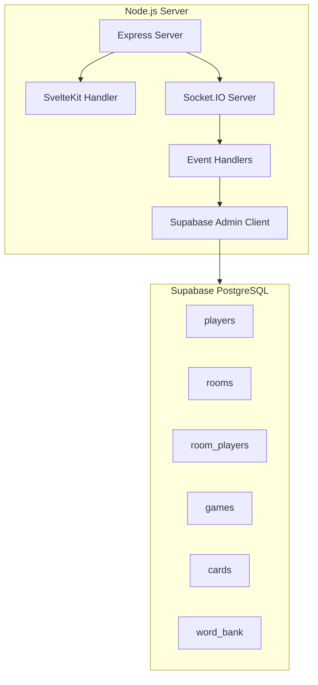

# Codenames Backend Implementation Plan

## Overview

This plan covers the backend implementation including database setup, Socket.IO server, and API endpoints. This will integrate with the frontend once the mocked UI is complete.

---

## Architecture (Backend)



---

## Phase 1: Database Setup

### 1.1 Schema Definition

Create `src/lib/server/schema.sql`:

```sql
-- Players table
CREATE TABLE players (
  id UUID PRIMARY KEY DEFAULT gen_random_uuid(),
  public_id VARCHAR(12) UNIQUE NOT NULL,
  nickname VARCHAR(32) NOT NULL,
  created_at TIMESTAMPTZ DEFAULT NOW()
);

-- Rooms table
CREATE TABLE rooms (
  id UUID PRIMARY KEY DEFAULT gen_random_uuid(),
  code VARCHAR(6) UNIQUE NOT NULL,
  status VARCHAR(20) DEFAULT 'waiting' CHECK (status IN ('waiting', 'playing', 'finished')),
  host_player_id UUID REFERENCES players(id),
  created_at TIMESTAMPTZ DEFAULT NOW(),
  updated_at TIMESTAMPTZ DEFAULT NOW()
);

-- Room-Player relationships
CREATE TABLE room_players (
  id UUID PRIMARY KEY DEFAULT gen_random_uuid(),
  room_id UUID REFERENCES rooms(id) ON DELETE CASCADE,
  player_id UUID REFERENCES players(id) ON DELETE CASCADE,
  team VARCHAR(10) CHECK (team IN ('red', 'blue', NULL)),
  role VARCHAR(20) CHECK (role IN ('spymaster', 'operative', NULL)),
  joined_at TIMESTAMPTZ DEFAULT NOW(),
  UNIQUE(room_id, player_id)
);

-- Games table (one per room when game starts)
CREATE TABLE games (
  id UUID PRIMARY KEY DEFAULT gen_random_uuid(),
  room_id UUID REFERENCES rooms(id) ON DELETE CASCADE UNIQUE,
  current_turn VARCHAR(10) NOT NULL CHECK (current_turn IN ('red', 'blue')),
  clue_word VARCHAR(50),
  clue_count INTEGER,
  guesses_remaining INTEGER,
  red_cards_remaining INTEGER DEFAULT 9,
  blue_cards_remaining INTEGER DEFAULT 8,
  winner VARCHAR(10) CHECK (winner IN ('red', 'blue', NULL)),
  started_at TIMESTAMPTZ DEFAULT NOW(),
  finished_at TIMESTAMPTZ
);

-- Cards table (25 per game)
CREATE TABLE cards (
  id UUID PRIMARY KEY DEFAULT gen_random_uuid(),
  game_id UUID REFERENCES games(id) ON DELETE CASCADE,
  word VARCHAR(50) NOT NULL,
  position INTEGER NOT NULL CHECK (position >= 0 AND position < 25),
  type VARCHAR(20) NOT NULL CHECK (type IN ('red', 'blue', 'neutral', 'assassin')),
  revealed BOOLEAN DEFAULT FALSE,
  revealed_at TIMESTAMPTZ,
  revealed_by UUID REFERENCES players(id),
  UNIQUE(game_id, position)
);

-- Word bank
CREATE TABLE word_bank (
  id UUID PRIMARY KEY DEFAULT gen_random_uuid(),
  word VARCHAR(50) UNIQUE NOT NULL,
  category VARCHAR(50),
  created_at TIMESTAMPTZ DEFAULT NOW()
);

-- Indexes
CREATE INDEX idx_rooms_code ON rooms(code);
CREATE INDEX idx_room_players_room ON room_players(room_id);
CREATE INDEX idx_room_players_player ON room_players(player_id);
CREATE INDEX idx_cards_game ON cards(game_id);
CREATE INDEX idx_games_room ON games(room_id);

-- Row Level Security
ALTER TABLE players ENABLE ROW LEVEL SECURITY;
ALTER TABLE rooms ENABLE ROW LEVEL SECURITY;
ALTER TABLE room_players ENABLE ROW LEVEL SECURITY;
ALTER TABLE games ENABLE ROW LEVEL SECURITY;
ALTER TABLE cards ENABLE ROW LEVEL SECURITY;

-- RLS Policies (using service role for server-side operations)
-- Public read for rooms (for join by code)
CREATE POLICY "Rooms are viewable by everyone" ON rooms FOR SELECT USING (true);
```

### 1.2 Seed Word Bank

Create `src/lib/server/seed-words.sql`:

```sql
INSERT INTO word_bank (word, category) VALUES
  ('AFRICA', 'geography'),
  ('AGENT', 'spy'),
  ('ALIEN', 'sci-fi'),
  -- ... 400+ words covering various categories
  ('ZOMBIE', 'horror');
```

---

## Phase 2: Server Infrastructure

### 2.1 Custom Server Entry Point

Create `server.js` in project root:

```javascript
import express from 'express';
import { createServer } from 'http';
import { Server } from 'socket.io';
import { handler } from './build/handler.js';
import { setupSocketHandlers } from './src/lib/server/socket.js';

const app = express();
const httpServer = createServer(app);

// Socket.IO setup
const io = new Server(httpServer, {
  cors: {
    origin: process.env.PUBLIC_URL || 'http://localhost:5173',
    methods: ['GET', 'POST']
  }
});

// Setup socket event handlers
setupSocketHandlers(io);

// SvelteKit handler for all other routes
app.use(handler);

const PORT = process.env.PORT || 3000;
httpServer.listen(PORT, () => {
  console.log(`Server running on port ${PORT}`);
});
```

### 2.2 Update package.json

```json
{
  "scripts": {
    "dev": "node server.js",
    "build": "vite build",
    "preview": "node server.js",
    "start": "node server.js"
  }
}
```

### 2.3 Environment Variables

Create `.env.example`:

```
PUBLIC_URL=http://localhost:5173
SUPABASE_URL=your_supabase_url
SUPABASE_ANON_KEY=your_anon_key
SUPABASE_SERVICE_ROLE_KEY=your_service_role_key
JWT_SECRET=your_jwt_secret
```

---

## Phase 3: Supabase Admin Client

### 3.1 Client Setup

Create `src/lib/server/supabaseAdmin.ts`:

```typescript
import { createClient } from '@supabase/supabase-js';

const supabaseUrl = process.env.SUPABASE_URL!;
const supabaseServiceKey = process.env.SUPABASE_SERVICE_ROLE_KEY!;

export const supabase = createClient(supabaseUrl, supabaseServiceKey);
```

### 3.2 Database Operations

Create `src/lib/server/db/index.ts`:

```typescript
// Player operations
export async function createPlayer(nickname: string): Promise<Player>
export async function getPlayer(id: string): Promise<Player | null>
export async function getPlayerByPublicId(publicId: string): Promise<Player | null>

// Room operations
export async function createRoom(hostPlayerId: string): Promise<Room>
export async function getRoomByCode(code: string): Promise<Room | null>
export async function updateRoomStatus(roomId: string, status: string): Promise<void>

// Room player operations
export async function joinRoom(roomId: string, playerId: string): Promise<void>
export async function leaveRoom(roomId: string, playerId: string): Promise<void>
export async function setTeamAndRole(roomId: string, playerId: string, team: string, role: string): Promise<void>
export async function getRoomPlayers(roomId: string): Promise<RoomPlayer[]>

// Game operations
export async function createGame(roomId: string, firstTeam: 'red' | 'blue'): Promise<Game>
export async function getGameByRoomId(roomId: string): Promise<Game | null>
export async function updateGameState(gameId: string, updates: Partial<Game>): Promise<void>

// Card operations
export async function createGameCards(gameId: string): Promise<Card[]>
export async function revealCard(cardId: string, playerId: string): Promise<Card>
export async function getGameCards(gameId: string): Promise<Card[]>

// Word bank
export async function getRandomWords(count: number): Promise<string[]>
```

---

## Phase 4: Socket.IO Event Handlers

### 4.1 Main Socket Setup

Create `src/lib/server/socket.ts`:

```typescript
import { Server, Socket } from 'socket.io';
import { verifyToken } from './auth.js';
import { handleRoomEvents } from './handlers/room.js';
import { handleGameEvents } from './handlers/game.js';

export function setupSocketHandlers(io: Server) {
  // Authentication middleware
  io.use(async (socket, next) => {
    const token = socket.handshake.auth.token;
    if (!token) {
      return next(new Error('Authentication required'));
    }
    
    try {
      const player = await verifyToken(token);
      socket.data.player = player;
      next();
    } catch (err) {
      next(new Error('Invalid token'));
    }
  });

  io.on('connection', (socket) => {
    console.log(`Player connected: ${socket.data.player.nickname}`);
    
    handleRoomEvents(io, socket);
    handleGameEvents(io, socket);
    
    socket.on('disconnect', () => {
      handleDisconnect(io, socket);
    });
  });
}
```

### 4.2 Room Event Handlers

Create `src/lib/server/handlers/room.ts`:

```typescript
// Events:
// room:create -> Creates new room, returns room code
// room:join -> Joins room by code
// room:leave -> Leaves current room
// room:changeTeam -> Changes player's team (red/blue/null)
// room:changeRole -> Changes player's role (spymaster/operative)

// Broadcasts:
// room:playerJoined -> To room members when player joins
// room:playerLeft -> To room members when player leaves
// room:updated -> Full room state to all members
```

**Event Handlers:**

```typescript
export function handleRoomEvents(io: Server, socket: Socket) {
  socket.on('room:create', async (callback) => {
    // 1. Generate unique room code
    // 2. Create room in database with player as host
    // 3. Join socket to room channel
    // 4. Return room code
  });

  socket.on('room:join', async ({ code }, callback) => {
    // 1. Find room by code
    // 2. Validate room exists and is joinable
    // 3. Add player to room_players
    // 4. Join socket to room channel
    // 5. Broadcast room:playerJoined to room
    // 6. Return room state
  });

  socket.on('room:leave', async () => {
    // 1. Remove from room_players
    // 2. Leave socket room channel
    // 3. Broadcast room:playerLeft
    // 4. If host left, assign new host or close room
  });

  socket.on('room:changeTeam', async ({ team }, callback) => {
    // 1. Update room_players team
    // 2. If was spymaster and changing team, clear role
    // 3. Broadcast room:updated
  });

  socket.on('room:changeRole', async ({ role }, callback) => {
    // 1. Validate role available (only one spymaster per team)
    // 2. Update room_players role
    // 3. Broadcast room:updated
  });
}
```

### 4.3 Game Event Handlers

Create `src/lib/server/handlers/game.ts`:

```typescript
// Events:
// game:start -> Starts the game (host only)
// game:giveClue -> Spymaster gives clue (word + count)
// game:guessCard -> Operative guesses a card
// game:endTurn -> Team ends their guessing turn early

// Broadcasts:
// game:started -> Initial game state (masked by role)
// game:clueGiven -> New clue to all players
// game:cardRevealed -> Card reveal result
// game:turnChanged -> Turn switched to other team
// game:ended -> Game over with winner
```

**Event Handlers:**

```typescript
export function handleGameEvents(io: Server, socket: Socket) {
  socket.on('game:start', async (callback) => {
    // 1. Validate player is host
    // 2. Validate teams have required players (2+ each, spymasters assigned)
    // 3. Create game record
    // 4. Generate and assign 25 cards from word bank
    // 5. Randomly assign card types (9-8-7-1)
    // 6. Update room status to 'playing'
    // 7. Broadcast game:started with role-masked state
  });

  socket.on('game:giveClue', async ({ word, count }, callback) => {
    // 1. Validate player is current team's spymaster
    // 2. Validate no active clue
    // 3. Validate word not on board (case-insensitive)
    // 4. Update game with clue
    // 5. Set guesses_remaining = count + 1
    // 6. Broadcast game:clueGiven
  });

  socket.on('game:guessCard', async ({ cardPosition }, callback) => {
    // 1. Validate player is current team's operative
    // 2. Validate clue is active and guesses remaining > 0
    // 3. Validate card not already revealed
    // 4. Reveal card in database
    // 5. Determine result:
    //    - Correct team card: decrement remaining, can continue
    //    - Other team card: turn ends
    //    - Neutral: turn ends
    //    - Assassin: game over, other team wins
    // 6. Check win conditions (team found all cards)
    // 7. Broadcast game:cardRevealed
    // 8. If turn ends, broadcast game:turnChanged
    // 9. If game ends, broadcast game:ended
  });

  socket.on('game:endTurn', async (callback) => {
    // 1. Validate player is on current team
    // 2. Clear clue and guesses
    // 3. Switch current_turn
    // 4. Broadcast game:turnChanged
  });
}
```

### 4.4 State Broadcasting with Role Masking

Create `src/lib/server/handlers/broadcast.ts`:

```typescript
export function broadcastGameState(io: Server, roomCode: string, game: Game, cards: Card[], players: RoomPlayer[]) {
  // Get all sockets in room
  const room = io.sockets.adapter.rooms.get(roomCode);
  if (!room) return;

  for (const socketId of room) {
    const socket = io.sockets.sockets.get(socketId);
    if (!socket) continue;

    const player = socket.data.player;
    const roomPlayer = players.find(p => p.player_id === player.id);
    const isSpymaster = roomPlayer?.role === 'spymaster';

    // Mask card types for non-spymasters
    const maskedCards = cards.map(card => ({
      ...card,
      type: (isSpymaster || card.revealed) ? card.type : 'hidden'
    }));

    socket.emit('game:state', {
      ...game,
      cards: maskedCards,
      players
    });
  }
}
```

---

## Phase 5: REST API Endpoints

### 5.1 Session API

Create `src/routes/api/session/+server.ts`:

```typescript
import { json } from '@sveltejs/kit';
import type { RequestHandler } from './$types';
import { createPlayer, getPlayerByPublicId } from '$lib/server/db';
import { generateToken } from '$lib/server/auth';

export const POST: RequestHandler = async ({ request }) => {
  const { nickname, publicId } = await request.json();

  let player;
  
  if (publicId) {
    // Resume existing session
    player = await getPlayerByPublicId(publicId);
    if (!player) {
      return json({ error: 'Player not found' }, { status: 404 });
    }
  } else {
    // Create new player
    player = await createPlayer(nickname);
  }

  const token = generateToken(player);

  return json({
    token,
    player: {
      id: player.public_id,
      nickname: player.nickname
    }
  });
};
```

### 5.2 Room Validation API

Create `src/routes/api/room/[code]/+server.ts`:

```typescript
import { json } from '@sveltejs/kit';
import type { RequestHandler } from './$types';
import { getRoomByCode } from '$lib/server/db';

export const GET: RequestHandler = async ({ params }) => {
  const room = await getRoomByCode(params.code);
  
  if (!room) {
    return json({ error: 'Room not found' }, { status: 404 });
  }

  return json({
    code: room.code,
    status: room.status,
    playerCount: room.player_count
  });
};
```

---

## Phase 6: Authentication

### 6.1 JWT Utilities

Create `src/lib/server/auth.ts`:

```typescript
import jwt from 'jsonwebtoken';

const JWT_SECRET = process.env.JWT_SECRET!;

export function generateToken(player: Player): string {
  return jwt.sign(
    { 
      id: player.id,
      publicId: player.public_id,
      nickname: player.nickname 
    },
    JWT_SECRET,
    { expiresIn: '7d' }
  );
}

export function verifyToken(token: string): Player {
  const decoded = jwt.verify(token, JWT_SECRET) as any;
  return {
    id: decoded.id,
    publicId: decoded.publicId,
    nickname: decoded.nickname
  };
}
```

---

## Phase 7: Game Logic Utilities

### 7.1 Card Generation

Create `src/lib/server/game/cards.ts`:

```typescript
export function generateCardTypes(firstTeam: 'red' | 'blue'): string[] {
  // First team gets 9 cards, second gets 8
  const types = [
    ...Array(firstTeam === 'red' ? 9 : 8).fill('red'),
    ...Array(firstTeam === 'blue' ? 9 : 8).fill('blue'),
    ...Array(7).fill('neutral'),
    'assassin'
  ];
  
  return shuffle(types);
}

export function shuffle<T>(array: T[]): T[] {
  const result = [...array];
  for (let i = result.length - 1; i > 0; i--) {
    const j = Math.floor(Math.random() * (i + 1));
    [result[i], result[j]] = [result[j], result[i]];
  }
  return result;
}
```

### 7.2 Validation Utilities

Create `src/lib/server/game/validation.ts`:

```typescript
export function validateClueWord(word: string, boardWords: string[]): boolean {
  const normalizedClue = word.toLowerCase().trim();
  const normalizedBoard = boardWords.map(w => w.toLowerCase());
  
  // Clue cannot match any board word
  if (normalizedBoard.includes(normalizedClue)) {
    return false;
  }
  
  // Clue cannot be a substring/superstring of board words (optional strict mode)
  // Additional validation rules can be added here
  
  return true;
}

export function canStartGame(players: RoomPlayer[]): { valid: boolean; error?: string } {
  const redTeam = players.filter(p => p.team === 'red');
  const blueTeam = players.filter(p => p.team === 'blue');
  
  if (redTeam.length < 2) {
    return { valid: false, error: 'Red team needs at least 2 players' };
  }
  if (blueTeam.length < 2) {
    return { valid: false, error: 'Blue team needs at least 2 players' };
  }
  if (!redTeam.some(p => p.role === 'spymaster')) {
    return { valid: false, error: 'Red team needs a spymaster' };
  }
  if (!blueTeam.some(p => p.role === 'spymaster')) {
    return { valid: false, error: 'Blue team needs a spymaster' };
  }
  
  return { valid: true };
}
```

---

## File Structure

```
project-root/
├── server.js                          # Custom server entry
├── .env                               # Environment variables
├── src/
│   ├── lib/
│   │   └── server/
│   │       ├── auth.ts                # JWT utilities
│   │       ├── supabaseAdmin.ts       # Supabase client
│   │       ├── socket.ts              # Socket.IO setup
│   │       ├── schema.sql             # Database schema
│   │       ├── seed-words.sql         # Word bank seed
│   │       ├── db/
│   │       │   └── index.ts           # Database operations
│   │       ├── handlers/
│   │       │   ├── room.ts            # Room socket handlers
│   │       │   ├── game.ts            # Game socket handlers
│   │       │   └── broadcast.ts       # State broadcasting
│   │       └── game/
│   │           ├── cards.ts           # Card generation
│   │           └── validation.ts      # Game validation
│   └── routes/
│       └── api/
│           ├── session/
│           │   └── +server.ts         # Session management
│           └── room/
│               └── [code]/
│                   └── +server.ts     # Room validation
```

---

## Integration with Frontend

When frontend mocks are complete, integrate as follows:

### Client-Side Changes

1. **Replace mock socket** with real Socket.IO client:

```typescript
// src/lib/stores/socket.ts
import { io } from 'socket.io-client';

const socket = io({
  auth: {
    token: localStorage.getItem('token')
  },
  autoConnect: false
});

export { socket };
```

2. **Update stores** to listen to socket events:

```typescript
// src/lib/stores/game.ts
import { socket } from './socket';

socket.on('game:state', (state) => {
  gameStore.set(state);
});

socket.on('game:cardRevealed', (data) => {
  // Update specific card
});
```

3. **Replace mock actions** with socket emissions:

```typescript
// Before (mock)
mockRevealCard(index, gameState);

// After (real)
socket.emit('game:guessCard', { cardPosition: index }, (response) => {
  if (response.error) handleError(response.error);
});
```

---

## Deployment Considerations

1. **Environment Variables**: Ensure all secrets are set in production
2. **Database Migrations**: Run schema.sql and seed-words.sql on Supabase
3. **WebSocket Support**: Ensure hosting platform supports WebSockets (Fly.io, Railway, etc.)
4. **CORS Configuration**: Update origins for production domain
5. **Connection Pooling**: Configure Supabase connection pooling for production load

