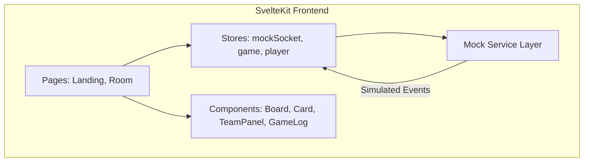

# Codenames Frontend Implementation Plan

## Overview

This plan covers the frontend implementation with **mocked data and functionality** to enable UI development and testing without a backend connection. All mock implementations will be replaced with actual Socket.IO connections in the integration phase.

---

## Architecture (Frontend Only)



---

## Phase 1: Mock Service Layer

### 1.1 Mock Data

Create `src/lib/mocks/data.ts`:

```typescript
// Sample word bank for testing
export const MOCK_WORDS = [
  'APPLE', 'BERLIN', 'CAT', 'DIAMOND', 'EAGLE',
  'FISH', 'GOLD', 'HOSPITAL', 'ICE', 'JUPITER',
  'KNIGHT', 'LAMP', 'MOON', 'NEEDLE', 'OPERA',
  'PIANO', 'QUEEN', 'ROBOT', 'SNOW', 'TIGER',
  'UMBRELLA', 'VOLCANO', 'WHALE', 'XRAY', 'ZEBRA'
];

// Card types distribution: 9 red, 8 blue, 7 neutral, 1 assassin (red starts)
export const MOCK_CARD_TYPES = [
  'red', 'red', 'red', 'red', 'red', 'red', 'red', 'red', 'red',
  'blue', 'blue', 'blue', 'blue', 'blue', 'blue', 'blue', 'blue',
  'neutral', 'neutral', 'neutral', 'neutral', 'neutral', 'neutral', 'neutral',
  'assassin'
];

export const MOCK_PLAYERS = [
  { id: '1', nickname: 'Alice', team: 'red', role: 'spymaster' },
  { id: '2', nickname: 'Bob', team: 'red', role: 'operative' },
  { id: '3', nickname: 'Charlie', team: 'blue', role: 'spymaster' },
  { id: '4', nickname: 'Diana', team: 'blue', role: 'operative' },
  { id: '5', nickname: 'You', team: 'red', role: 'operative' }
];

export const MOCK_LOG_ENTRIES = [
  { type: 'system', message: 'Game started', timestamp: Date.now() - 60000 },
  { type: 'clue', team: 'red', message: 'Alice gave clue: ANIMAL 3', timestamp: Date.now() - 50000 },
  { type: 'guess', team: 'red', message: 'Bob guessed TIGER ✓', timestamp: Date.now() - 40000 },
  { type: 'guess', team: 'red', message: 'Bob guessed CAT ✓', timestamp: Date.now() - 30000 },
  { type: 'turn', message: 'Blue team\'s turn', timestamp: Date.now() - 20000 }
];
```

### 1.2 Mock Socket Service

Create `src/lib/mocks/mockSocket.ts`:

```typescript
// Simulates Socket.IO behavior for UI testing
// Emits events with delays to simulate network latency

export function createMockSocket() {
  const listeners = new Map<string, Function[]>();
  
  return {
    on(event: string, callback: Function) {
      if (!listeners.has(event)) listeners.set(event, []);
      listeners.get(event)!.push(callback);
    },
    
    emit(event: string, data?: any) {
      // Simulate server response with delay
      setTimeout(() => {
        // Handle mock responses based on event type
        handleMockEvent(event, data, listeners);
      }, 100 + Math.random() * 200);
    },
    
    off(event: string, callback?: Function) {
      if (callback) {
        const eventListeners = listeners.get(event);
        if (eventListeners) {
          const index = eventListeners.indexOf(callback);
          if (index > -1) eventListeners.splice(index, 1);
        }
      } else {
        listeners.delete(event);
      }
    },
    
    // Helper to trigger events (for testing)
    _trigger(event: string, data: any) {
      listeners.get(event)?.forEach(cb => cb(data));
    }
  };
}
```

### 1.3 Mock Game Actions

Create `src/lib/mocks/mockActions.ts`:

```typescript
// Functions that simulate server responses
// Used to test UI state changes

export function mockRevealCard(cardIndex: number, gameState: GameState) {
  // Returns updated game state as if server processed it
}

export function mockGiveClue(word: string, count: number, gameState: GameState) {
  // Returns updated game state with new clue
}

export function mockEndTurn(gameState: GameState) {
  // Switches to other team
}

export function mockJoinTeam(team: 'red' | 'blue', role: 'operative' | 'spymaster') {
  // Updates player assignment
}
```

---

## Phase 2: State Management (Stores)

### 2.1 Player Store

Create `src/lib/stores/player.ts`:

```typescript
// Writable store for current player info
// - id, nickname, team, role
// - isSpymaster derived
// - Mock: Initialize with test player data
```

### 2.2 Game Store

Create `src/lib/stores/game.ts`:

```typescript
// Reactive game state store
interface GameState {
  status: 'lobby' | 'playing' | 'finished';
  cards: Card[];
  currentTurn: 'red' | 'blue';
  clue: { word: string; count: number } | null;
  guessesRemaining: number;
  scores: { red: number; blue: number };
  winner: 'red' | 'blue' | null;
  players: Player[];
  log: LogEntry[];
}

// Derived stores:
// - isMyTurn: currentTurn matches player team
// - canGuess: isMyTurn && player is operative && clue exists
// - canGiveClue: isMyTurn && player is spymaster && no active clue
// - visibleCards: if spymaster, show types; otherwise hide unrevealed
```

### 2.3 Room Store

Create `src/lib/stores/room.ts`:

```typescript
// Room state for lobby
interface RoomState {
  code: string;
  hostId: string;
  status: 'waiting' | 'playing';
  players: Player[];
}
```

---

## Phase 3: UI Components

All components in `src/lib/components/`:

### 3.1 Card.svelte

```
Props:
  - word: string
  - type: 'red' | 'blue' | 'neutral' | 'assassin'
  - revealed: boolean
  - showType: boolean (for spymaster view)
  - clickable: boolean

States:
  - Unrevealed: Cream/beige background, dark text, uppercase
  - Revealed: Team color background (red/blue/gray/black)
  - Hover: Subtle lift effect when clickable

Events:
  - on:click - Only fires if clickable=true
```

### 3.2 Board.svelte

```
Props:
  - cards: Card[] (25 items)
  - onCardClick: (index: number) => void
  - isSpymaster: boolean

Layout:
  - CSS Grid 5x5
  - Responsive sizing (min 60px, max 120px per card)
  - Gap between cards
```

### 3.3 TeamPanel.svelte

```
Props:
  - team: 'red' | 'blue'
  - score: number
  - totalCards: number
  - players: Player[]
  - isActive: boolean

Layout:
  - Colored header bar (red/blue)
  - Score display: "8 cards left"
  - Player list grouped by role
  - Active indicator (glow/border when team's turn)
```

### 3.4 StatusBanner.svelte

```
Props:
  - message: string
  - type: 'info' | 'red' | 'blue' | 'warning'

Appearance:
  - Cream/white rounded rectangle
  - Bold centered text
  - Positioned at top center
```

### 3.5 GameLog.svelte

```
Props:
  - entries: LogEntry[]

Features:
  - Scrollable container
  - Auto-scroll to bottom on new entries
  - Color-coded by team/type
  - Timestamps
```

### 3.6 ClueInput.svelte

```
Props:
  - disabled: boolean
  - onSubmit: (word: string, count: number) => void

Form:
  - Text input for clue word (validation: no board words)
  - Number selector (0-9, unlimited)
  - Submit button
```

### 3.7 PlayerList.svelte

```
Props:
  - players: Player[]
  - currentPlayerId: string

Display:
  - Player nickname with team color badge
  - Role indicator (crown for spymaster)
  - "You" indicator for current player
```

### 3.8 NicknameDialog.svelte

```
Modal dialog for entering nickname on first visit
- Text input
- Submit button
- Saves to localStorage
```

---

## Phase 4: Page Routes

### 4.1 Landing Page `src/routes/+page.svelte`

**Layout:**
- Centered container
- Game title/logo
- Nickname display (editable)
- "Create Room" button → generates mock room code, navigates to /room/[code]
- "Join Room" input + button → validates code format, navigates to /room/[code]

**Mock Behavior:**
- Create Room: Generate random 4-letter code (e.g., "ABCD")
- Join Room: Accept any 4-letter code

### 4.2 Game Room `src/routes/room/[code]/+page.svelte`

**Lobby State (status = 'waiting'):**
- Room code display with copy button
- Two team columns (Red / Blue)
- "Join Team" buttons
- "Become Spymaster" buttons (disabled if taken)
- Player list per team
- "Start Game" button (mock: always enabled for testing)

**Game State (status = 'playing'):**
- Full layout matching reference image:
  - StatusBanner at top center
  - Red TeamPanel on left
  - Board in center
  - Blue TeamPanel on right
  - GameLog on far right
- Conditional UI based on role:
  - Spymaster: See card types, show ClueInput when their turn
  - Operative: Cards hidden, click to guess when their turn

**Mock Interactions:**
- Click card → mock reveal with delay
- Submit clue → mock state update
- End turn button → switch teams
- Clicking assassin → game over state

---

## Phase 5: Visual Styling

### 5.1 Global Styles `src/routes/layout.css`

```css
/* Dark theme base */
:root {
  --bg-dark: #1a1a2e;
  --bg-darker: #16162a;
  --card-cream: #f5e6c8;
  --card-cream-hover: #faf0dc;
  --team-red: #c41e3a;
  --team-blue: #1e5aa8;
  --neutral-gray: #6b7280;
  --assassin-black: #1f2937;
  --text-light: #f3f4f6;
  --text-dark: #1f2937;
  --banner-cream: #fef3c7;
}

/* Dot pattern background */
body {
  background: 
    radial-gradient(circle at center, #2a2a4e 0%, #1a1a2e 100%),
    repeating-radial-gradient(circle at center, transparent 0, transparent 10px, rgba(255,255,255,0.03) 10px, rgba(255,255,255,0.03) 11px);
}
```

### 5.2 Card Styles

```css
.card {
  /* Unrevealed */
  background: var(--card-cream);
  color: var(--text-dark);
  text-transform: uppercase;
  font-weight: 700;
  border-radius: 8px;
  box-shadow: 0 4px 6px rgba(0,0,0,0.3);
  transition: transform 0.2s, box-shadow 0.2s;
}

.card:hover:not(.revealed) {
  transform: translateY(-2px);
  box-shadow: 0 6px 12px rgba(0,0,0,0.4);
}

.card.revealed.red { background: var(--team-red); color: white; }
.card.revealed.blue { background: var(--team-blue); color: white; }
.card.revealed.neutral { background: var(--neutral-gray); color: white; }
.card.revealed.assassin { background: var(--assassin-black); color: white; }
```

### 5.3 Team Panel Styles

```css
.team-panel {
  background: var(--bg-darker);
  border-radius: 12px;
  overflow: hidden;
}

.team-panel.red .header { background: var(--team-red); }
.team-panel.blue .header { background: var(--team-blue); }

.team-panel.active {
  box-shadow: 0 0 20px rgba(255,255,255,0.2);
}
```

---

## Phase 6: Mock Testing Scenarios

Create `src/lib/mocks/scenarios.ts` for testing different game states:

```typescript
export const SCENARIOS = {
  // Lobby with various player configurations
  lobbyEmpty: { ... },
  lobbyPartial: { ... },
  lobbyReady: { ... },
  
  // Game states
  gameStart: { ... },
  redSpymasterTurn: { ... },
  redOperativesTurn: { ... },
  blueSpymasterTurn: { ... },
  gameNearEnd: { ... },
  gameOverRedWins: { ... },
  gameOverAssassin: { ... },
};

// Function to load a scenario into stores
export function loadScenario(name: keyof typeof SCENARIOS) { ... }
```

Add dev-only UI to switch between scenarios for testing.

---

## File Structure

```
src/
├── lib/
│   ├── components/
│   │   ├── Board.svelte
│   │   ├── Card.svelte
│   │   ├── ClueInput.svelte
│   │   ├── GameLog.svelte
│   │   ├── NicknameDialog.svelte
│   │   ├── PlayerList.svelte
│   │   ├── StatusBanner.svelte
│   │   └── TeamPanel.svelte
│   ├── mocks/
│   │   ├── data.ts
│   │   ├── mockActions.ts
│   │   ├── mockSocket.ts
│   │   └── scenarios.ts
│   ├── stores/
│   │   ├── game.ts
│   │   ├── player.ts
│   │   └── room.ts
│   └── types.ts
├── routes/
│   ├── +layout.svelte
│   ├── +page.svelte
│   ├── layout.css
│   └── room/
│       └── [code]/
│           └── +page.svelte
```

---

## Integration Notes

When backend is ready, replace mocks with real implementations:

1. **Replace `src/lib/mocks/mockSocket.ts`** with `src/lib/stores/socket.ts` that connects to actual Socket.IO server
2. **Remove `src/lib/mocks/` directory** entirely
3. **Update stores** to receive state from socket events instead of mock data
4. **Update page components** to emit real socket events instead of calling mock functions
5. **Remove scenario selector** dev UI

The component interfaces (`Board`, `Card`, `TeamPanel`, etc.) should remain unchanged - only the data sources change.

